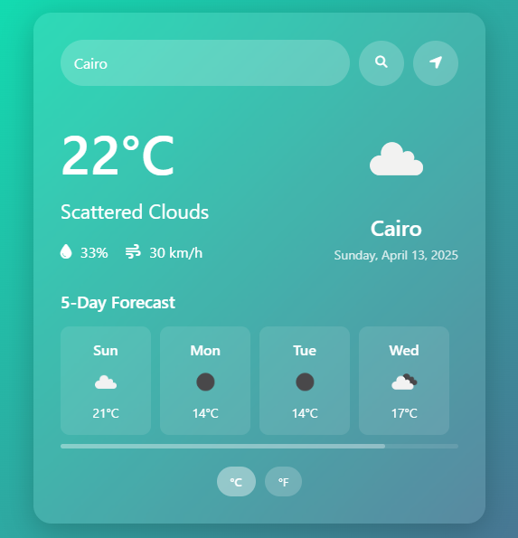

# 🌤️ Weather Dashboard

A responsive weather application built with React and Tailwind CSS that displays current weather conditions and forecasts using the OpenWeatherMap API.

## ✨ Features

- 🏙️ Search weather by city name
- 📍 Get weather for current location
- 🌡️ Temperature in Celsius/Fahrenheit
- 🌦️ 5-day weather forecast
- ⏱️ Auto-refresh every 10 minutes
- 📱 Fully responsive design

## 🚀 Getting Started

### Prerequisites
- Node.js (v16+)
- npm (v7+)
- OpenWeatherMap API key

### Installation
1. Clone the repository

   git clone https://github.com/hassanfahmyzaky/WeatherApp.git
   npm install
   npm run dev